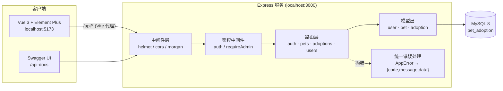
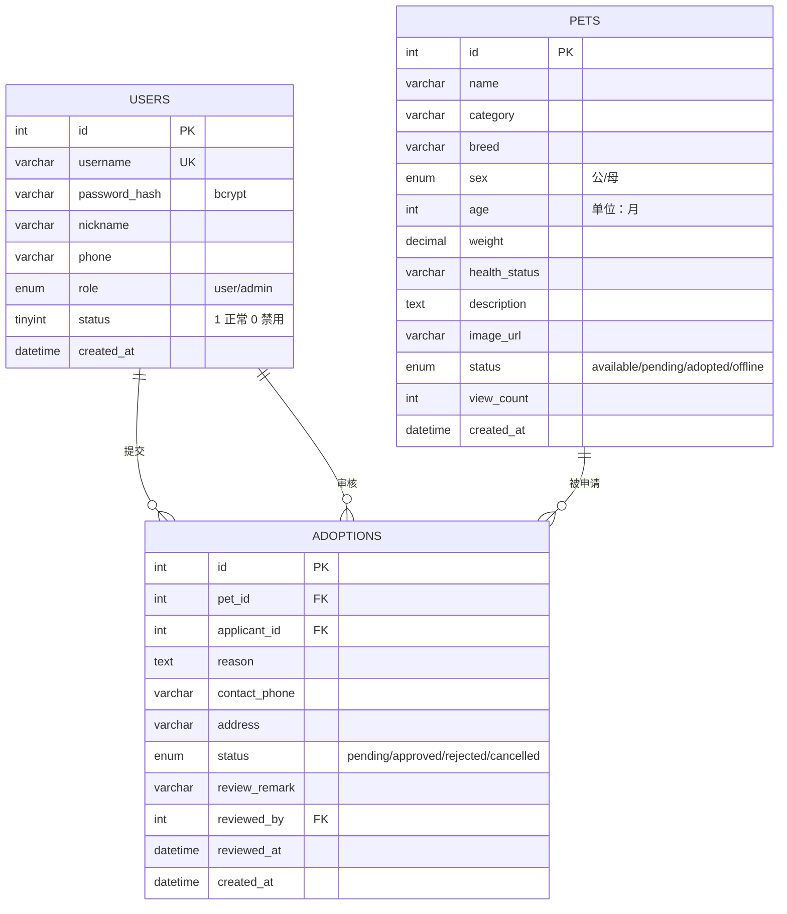
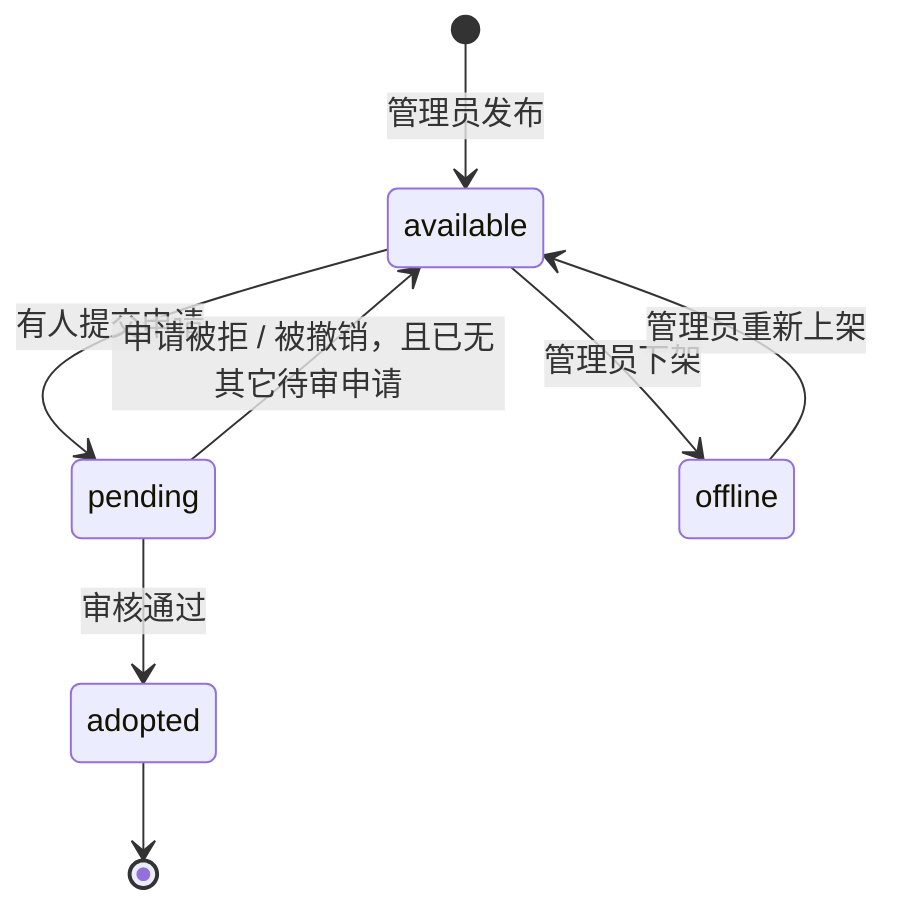
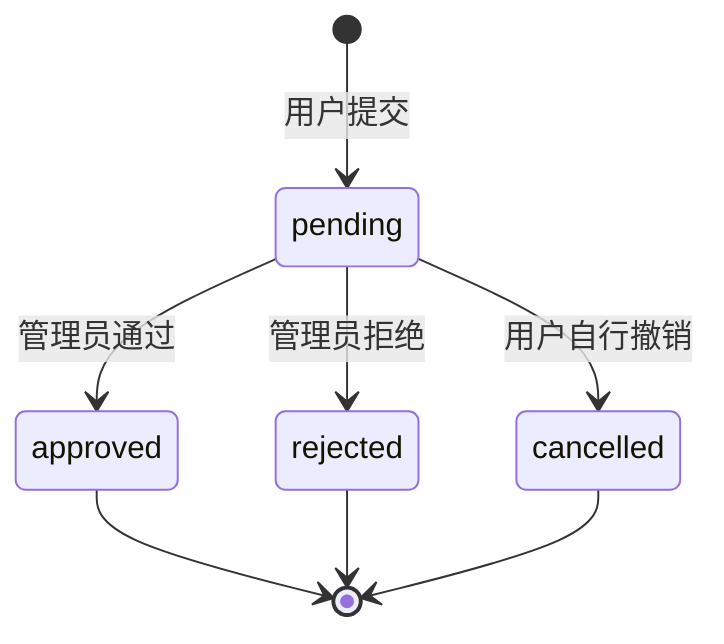

# 宠物领养管理系统

一个把「宠物领养」这条业务链路真正跑通的**前后端分离**项目：Express + MySQL 提供 REST API，Vue 3 + Element Plus 做前台浏览与后台审核，业务上完整覆盖 `发布宠物 → 提交申请 → 管理员审核 → 宠物状态流转` 的全过程。

项目重点不在「能增删改查」，而在于把**并发安全、状态机约束、统一鉴权与错误处理、可测试性**这些工程细节补齐。

<p>
  
  
  
  
  
</p>

## 目录

- [在线体验](#在线体验)
- [功能一览](#功能一览)
- [技术栈](#技术栈)
- [系统架构](#系统架构)
- [快速开始](#快速开始)
- [接口文档](#接口文档)
- [数据库设计](#数据库设计)
- [核心业务：领养状态机](#核心业务领养状态机)
- [测试](#测试)
- [技术亮点](#技术亮点)
- [目录结构](#目录结构)

## 在线体验

本地起服务后：

| 入口 | 地址 | 说明 |
| --- | --- | --- |
| 前台首页 | http://localhost:5173 | Vue3 前台：宠物列表、详情、提交申请、我的申请 |
| 管理后台 | http://localhost:5173/admin/dashboard | 数据看板、宠物管理、领养审核、用户管理 |
| 服务首页 | http://localhost:3000/api-guide | 后端自带的接口导航页 |
| 接口文档 | http://localhost:3000/api-docs | Swagger UI，可直接在线调试 |
| 健康检查 | http://localhost:3000/health | 用于探活 / 容器健康检查 |

> 用 Docker 启动时无需前端开发服务器：镜像内会构建 `web/dist`，后端检测到后会自动托管前端页面（history 路由也已接管），**直接访问 http://localhost:3000 就是完整界面**。

演示账号：

| 角色 | 用户名 | 密码 |
| --- | --- | --- |
| 管理员 | `admin` | `admin123` |
| 普通用户 | `alice` | `123456` |

> 执行 `npm run db:reset` 会重建库表并写入 8 只演示宠物与 5 条演示申请（覆盖通过 / 拒绝 / 待审 / 多人竞申四种场景）。

## 功能一览

**前台（无需登录即可浏览）**

- 宠物列表：分页、按名称/品种/描述关键词搜索、按分类/性别/状态筛选
- 宠物详情：浏览量自动 `+1`，展示健康状况、年龄、体重等结构化信息
- 领养申请：填写领养理由 + 联系电话 + 联系地址，提交后宠物进入「审核中」
- 我的申请：按状态查看进度，待审核的申请可自行撤销

**后台（需管理员）**

- 数据看板：宠物/申请/用户各项统计 + ECharts 图表（状态分布、近 7 天申请趋势、分类分布、浏览量 Top5）
- 宠物管理：新增、编辑、删除，可指定上架状态
- 领养审核：通过 / 拒绝并填写审核意见；通过后自动联动宠物状态与其它申请
- 用户管理：搜索、按角色筛选、启用/禁用、删除（管理员账号受保护）

## 技术栈

| 层次 | 选型 | 说明 |
| --- | --- | --- |
| 运行时 | Node.js ≥ 18 | 使用 `async/await` 与 `AbortController` 等现代特性 |
| Web 框架 | Express 4 | 分层路由，业务逻辑收敛到 model 层 |
| 数据库 | MySQL 8 + `mysql2` | 连接池 + 参数化查询 + 事务 + 行级锁 |
| 认证 | JWT（`jsonwebtoken`） | 无状态鉴权，`Bearer` 头携带 |
| 密码 | `bcryptjs` | 加盐哈希，出口永不带出 `password_hash` |
| 参数校验 | `express-validator` | 校验链与业务分离，统一错误出口 |
| 安全 | `helmet` + `cors` | 安全响应头、跨域白名单 |
| 日志 | `morgan` | 开发环境输出精简请求日志 |
| 接口文档 | `swagger-jsdoc` + `swagger-ui-express` | 从 JSDoc 注释自动生成 OpenAPI 3 |
| 测试 | Jest + Supertest | 3 个套件 / 60 个用例，独立测试库 |
| 前端 | Vue 3 + Vite 5 | `<script setup>` 组合式 API |
| UI | Element Plus + ECharts 5 | 中后台组件与图表 |
| 状态管理 | Pinia | 登录态与用户信息持久化到 `localStorage` |
| 部署 | Docker + docker-compose | 多阶段构建、非 root 运行、内置健康检查 |

## 系统架构



分层职责：**路由只负责「取参 → 校验 → 调模型 → 统一响应」**，所有 SQL 与事务都在 `models/`，`utils/` 放纯函数，`middleware/` 放横切逻辑。这样控制器里看不到一行 SQL，模型里也看不到 `req/res`。

## 快速开始

### 方式一：本地运行

```bash
# 1. 准备数据库（MySQL 8）
mysql -u root -p -e "CREATE DATABASE pet_adoption DEFAULT CHARACTER SET utf8mb4 COLLATE utf8mb4_unicode_ci;"

# 2. 后端
cd pet
npm install
cp .env.example .env          # Windows: copy .env.example .env
#   然后编辑 .env，至少填对 DB_PASSWORD 与 JWT_SECRET
npm run db:init               # 建表 + 管理员 + 演示数据（--reset 可强制重建）
npm run dev                   # http://localhost:3000

# 3. 前端
cd web
npm install
npm run dev                   # http://localhost:5173
```

### 方式二：Docker 一键起

```bash
docker compose up -d --build
# MySQL: localhost:3306   API + 前端: http://localhost:3000
```

镜像分三个阶段构建：`web-builder`（构建 Vue 前端）→ `builder`（安装后端生产依赖）→ 运行阶段（`node:20-alpine` + 非 root 用户）。`docker-compose.yml` 里 MySQL 带 `healthcheck`，API 容器 `depends_on` 其健康后再启动，避免「数据库还没起来服务就崩」。

### 环境变量

| 变量 | 默认值 | 说明 |
| --- | --- | --- |
| `PORT` | `3000` | 服务端口 |
| `DB_HOST` / `DB_PORT` | `127.0.0.1` / `3306` | 数据库地址 |
| `DB_USER` / `DB_PASSWORD` | `root` / - | 数据库账号 |
| `DB_NAME` | `pet_adoption` | 库名（测试时会被覆盖为 `pet_adoption_test`） |
| `JWT_SECRET` | - | **生产环境缺失会直接启动失败** |
| `JWT_EXPIRES_IN` | `24h` | Token 有效期 |
| `ADMIN_USERNAME` / `ADMIN_PASSWORD` | `admin` / `admin123` | 首次初始化创建的管理员 |
| `BCRYPT_ROUNDS` | `10` | 哈希强度 |

## 接口文档

启动服务后访问 **http://localhost:3000/api-docs** 在线调试；原始定义在 `/api-docs.json`。

| 方法 | 路径 | 权限 | 说明 |
| --- | --- | --- | --- |
| POST | `/api/auth/register` | 公开 | 注册 |
| POST | `/api/auth/login` | 公开 | 登录，返回 JWT |
| GET | `/api/auth/profile` | 登录 | 当前用户资料 |
| PUT | `/api/auth/profile` | 登录 | 修改昵称 / 手机号 |
| PUT | `/api/auth/password` | 登录 | 修改密码（校验原密码） |
| GET | `/api/pets` | 公开 | 宠物列表（分页 / 搜索 / 筛选） |
| GET | `/api/pets/:id` | 公开 | 宠物详情（浏览量 +1） |
| GET | `/api/pets/categories` | 公开 | 分类列表 |
| POST | `/api/pets` | 管理员 | 新增宠物 |
| PUT | `/api/pets/:id` | 管理员 | 修改宠物 |
| DELETE | `/api/pets/:id` | 管理员 | 删除宠物 |
| GET | `/api/pets/stats` | 管理员 | 宠物看板统计 |
| POST | `/api/adoptions` | 登录 | 提交领养申请 |
| GET | `/api/adoptions/mine` | 登录 | 我的申请 |
| DELETE | `/api/adoptions/:id` | 登录 | 撤销自己的待审申请 |
| GET | `/api/adoptions` | 管理员 | 全部申请（分页 / 状态 / 关键词） |
| PUT | `/api/adoptions/:id/review` | 管理员 | 审核（通过 / 拒绝） |
| GET | `/api/adoptions/stats` | 管理员 | 领养看板统计 |
| GET | `/api/users` | 管理员 | 用户列表 |
| PUT | `/api/users/:id/status` | 管理员 | 启用 / 禁用 |
| DELETE | `/api/users/:id` | 管理员 | 删除用户 |
| GET | `/api/users/stats` | 管理员 | 用户看板统计 |

所有响应统一为：

```json
{ "code": 200, "message": "操作成功", "data": {} }
```

分页数据统一为 `{ list, total, page, size, pages }`。

## 数据库设计



外键策略：`adoptions.pet_id` 用 `ON DELETE CASCADE`（宠物被删，相关申请一并清理）；`adoptions.applicant_id` / `reviewed_by` 用 `ON DELETE SET NULL`（用户被删不影响申请记录的可追溯性）。

## 核心业务：领养状态机

这套状态流转是整个项目的核心，也是本项目**并发问题最集中的地方**。

**宠物状态**



**申请状态**



三条关键约束及实现方式：

1. **同一宠物同一用户不可重复申请**
   事务内先 `SELECT ... FOR UPDATE` 锁住宠物行，再查是否已存在 `pending/approved` 的申请，存在则返回 `409`。
2. **审核通过要同时改两张表**
   `adoptions` 置为 `approved`、同宠物其它 `pending` 申请自动置为 `rejected`、`pets` 置为 `adopted` —— 三步写在同一个事务里，任一步失败整体回滚，不会出现「申请通过了但宠物还显示待领养」的脏数据。
3. **拒绝 / 撤销后要恢复宠物状态**
   只有当该宠物**再无任何待审申请**时，才把它从 `pending` 恢复为 `available`；否则其它申请人的申请会被误伤。

## 测试

```bash
npm test        # jest --runInBand
```

```
Test Suites: 3 passed, 3 total
Tests:       60 passed, 60 total
Time:        ~8 s
```

| 套件 | 覆盖内容 |
| --- | --- |
| `tests/auth.test.js` | 注册校验、重复用户名、登录成功/失败、禁用账号、Token 校验、改资料与改密码 |
| `tests/pet.test.js` | 分页与限幅、关键词/分类/状态筛选、详情浏览量、增删改权限、字段校验 |
| `tests/adoption.test.js` | 完整状态机：提交 → 审核通过 / 拒绝、重复申请、撤销、多人竞申、权限边界、看板统计 |

测试跑在独立库 `pet_adoption_test` 上：`globalSetup` 会 `DROP + CREATE` 并执行 `init.sql`，`globalTeardown` 负责清理连接，**不会污染开发数据**。

## 技术亮点

面试里值得展开讲的几处：

- **并发安全的领养流程**：用 `SELECT ... FOR UPDATE` 行级锁 + 事务，把「校验 → 写申请 → 改宠物状态」做成一个原子操作。两个用户同时申请同一只宠物、或管理员同时点两次「通过」，都不会产生重复申请或状态错乱。
- **统一鉴权与错误处理**：`auth` / `requireAdmin` 两个中间件承担全部鉴权；业务代码只 `throw new AppError('...', 409)`，由 `errorHandler` 统一翻译成 `{code, message}`，并把 MySQL 错误码（`ER_DUP_ENTRY`、`ER_NO_REFERENCED_ROW_2` 等）映射成可读提示；生产环境隐藏堆栈。
- **权限边界下沉到模型层**：「不能禁用/删除管理员」「不能删除自己」这类规则不写在路由里，而是写在 `models/user.js`，任何调用方都绕不过去。
- **分页限幅防拖库**：`normalizePagination` 统一处理 `page/size`，把 `size` 夹在 `1..100`，并让模型直接返回归一化后的值，避免前端传 `size=99999` 把库拖垮。
- **动态 SQL 只拼字段名、不拼值**：所有查询值一律走 `?` 占位符；`LIKE` 搜索用 `utils/sql.js` 转义 `%` `_` `\`，防注入也防通配符攻击。
- **可测试性设计**：`app.js` 导出 `{ app, bootstrap }`，测试直接 import `app` 交给 Supertest，无需真实监听端口；`bootstrap()` 单独负责 `db.ping()` 与优雅关闭。
- **接口文档即代码**：OpenAPI 定义以 JSDoc 形式写在路由旁边，改代码时顺手改文档，`/api-docs` 永远和实现同步。
- **前后端一体交付**：`app.js` 启动时检测 `web/dist` 是否存在，存在就自动加上静态托管与 history 路由兜底（同时排除 `/api`、`/api-docs`、`/health`），因此同一份代码在开发期是「Vite 代理 + 独立前端」，在 Docker 里是「单端口全栈服务」，不需要维护两套启动方式。

## 目录结构

```
pet/
├── app.js                    # 应用装配 + bootstrap（端口监听 / 优雅关闭）
├── init.sql                  # 建表 DDL
├── config/index.js           # 集中配置读取 + 默认值 + 生产环境强校验
├── db/db.js                  # 连接池、query/run、transaction、ping、close
├── middleware/
│   ├── auth.js               # auth / requireAdmin / signToken
│   └── errorHandler.js       # notFound + 统一错误处理
├── models/                   # 全部 SQL 与事务（user / pet / adoption）
├── router/                   # 路由 + 校验链 + OpenAPI 注释
├── utils/                    # AppError / response / sql / pagination / asyncHandler
├── scripts/init-db.js        # db:init / db:reset / --seed
├── tests/                    # Jest + Supertest（3 套件 60 用例）
├── docs/swagger.js           # OpenAPI 全局定义
├── public/index.html         # 服务首页（接口导航）
├── web/                      # Vue3 前端
│   ├── src/api/              # axios 实例 + 401 统一处理 + 接口封装
│   ├── src/stores/           # Pinia 登录态
│   ├── src/router/           # 路由 + 登录/管理员守卫
│   ├── src/layout/           # 前台布局 / 后台布局
│   ├── src/views/            # 7 个页面
│   └── src/utils/dict.js     # 状态字典（与后端枚举对齐）
├── Dockerfile                # 三阶段构建：前端 → 后端依赖 → 运行镜像
├── docker-compose.yml
├── .dockerignore
└── README.md
```

## 截图

运行 `npm run dev` 后可按 [`docs/screenshots/README.md`](docs/screenshots/README.md) 的说明补充截图。

## 说明

- `DESIGN.md` 记录了本次重构的设计取舍（分层方式、事务边界、错误码约定）。
- 此项目为课程作业的二次重构版本，重构目标是把一个「能跑的 CRUD」打磨成「讲得清工程细节」的项目。

## License

MIT
